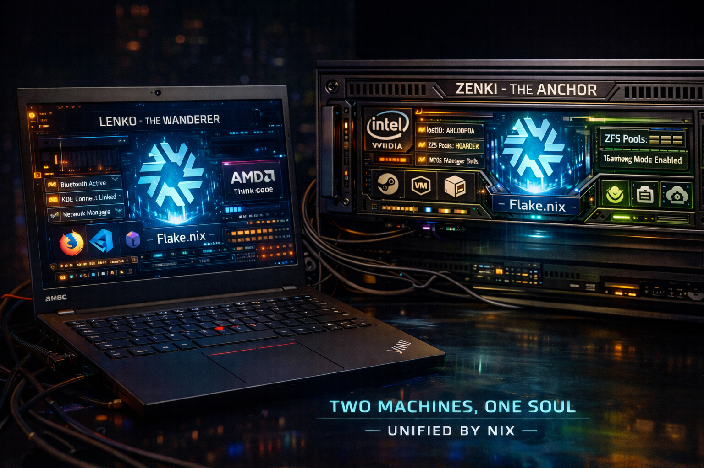
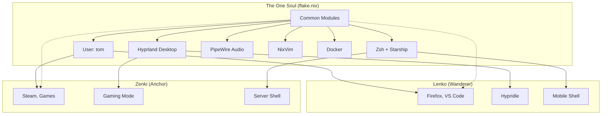

# The Legend of Lenko and Zenki: Two Machines, One Soul



## The Origin

In the realm of `/home/tom/nix-config`, there existed a great flake - a crystallization of pure declarative wisdom. From this single source of truth, two vessels were forged, each bearing a fragment of the same essence, yet destined for different purposes.

## Lenko — The Wanderer

Lenko emerged as a **Thinkpad T14**, forged with the heart of **AMD** (`kvm-amd` beats within). Born to roam, Lenko carries the spirit of mobility:

```nix
# The wanderer's essence
hardware.bluetooth.enable = true;  # To connect with the world
programs.kdeconnect.enable = true;  # To commune with distant devices
networking.networkmanager.enable = true;  # To adapt to any network
```

Lenko is the **scribe and messenger**, bearing tools of creation:
- [`firefox.nix`](home-manager/modules/firefox.nix) — the window to knowledge
- [`vscode.nix`](home-manager/modules/vscode.nix) — the forge of code
- [`piper.nix`](modules/piper.nix) — to tame the mouse
- [`printing.nix`](modules/printing.nix) — to manifest thoughts into paper

The wanderer knows rest, and thus carries [`hypridle`](home-manager/modules/hypridle.nix) to slumber when idle. The GNOME keyring guards its secrets as it travels the digital highways.

## Zenki — The Anchor

Zenki arose as a **stationary titan**, powered by **Intel** (`kvm-intel` pulses through its circuits). It is the **server and gaming rig**, bound to one place but mighty:

```nix
# The anchor's essence
networking.hostId = "a8c00f0a";  # Its eternal identity
boot.zfs.extraPools = [ "hoarder-data" "impo-data" ];  # Its vast memory vaults
```

Zenki wields the power of **NVIDIA**, with custom fan control to temper its fury. It bears the **Intel QSV** for swift video transcoding. Through its **10Gbit Ethernet** (`eth10g`), it stands as a fortress on VLAN 10 (`192.168.10.15`).

The anchor is both **playground and sanctuary**:
- [`gaming.nix`](modules/gaming.nix) — Steam, GameMode, the realm of play
- [`libvirt.nix`](modules/libvirt.nix) — to birth virtual worlds
- [`cockpit.nix`](modules/cockpit.nix) — the web of command
- [`backup-zfs.nix`](modules/backup-zfs.nix) & [`backup-docker.nix`](modules/backup-docker.nix) — the guardians of preservation

## The Shared Soul

Though their forms differ, Lenko and Zenki share the **same soul**—the Nix flake that defines their being:



Their shared essence flows through:
- **[`common.nix`](modules/common.nix)** — The foundation: user "tom", timezone `Europe/Ljubljana`, Slovenian keyboard, zsh with starship
- **[`desktop.nix`](modules/desktop.nix)** — The face: Hyprland, greetd, PipeWire, Waybar, fonts
- **[`home-manager/users/tom.nix`](home-manager/users/tom.nix)** — The personal realm: packages, git, python, yazi, rofi

Both breathe the same declarative air, both respond to the same `nixos-rebuild switch`, both inherit from the same modules.

## The Eternal Bond

When Tom sits at Lenko, he is the wanderer—coding in VS Code, browsing Firefox, connected to networks far and wide. When Tom sits at Zenki, he is the anchor—gaming in Steam, managing Docker containers, tending to the hoards of data.

Yet in both places, his home is the same. His shell greets him identically. His Hyprland workspace feels familiar. His `nvim` awaits with the same configuration.

```nix
# From flake.nix, the declaration of their unity
nixosConfigurations = {
  zenki = nixpkgs.lib.nixosSystem { /* ... */ };
  lenko = nixpkgs.lib.nixosSystem { /* ... */ };
};
```

Two machines, one soul. The wanderer and the anchor, bound by the immutable promise of Nix—**reproducible, declarative, eternal**.

---

*And thus, in the house of Tom, Lenko roams while Zenki stands guard, both animated by the same flake, both serving the same master, both forever one.*