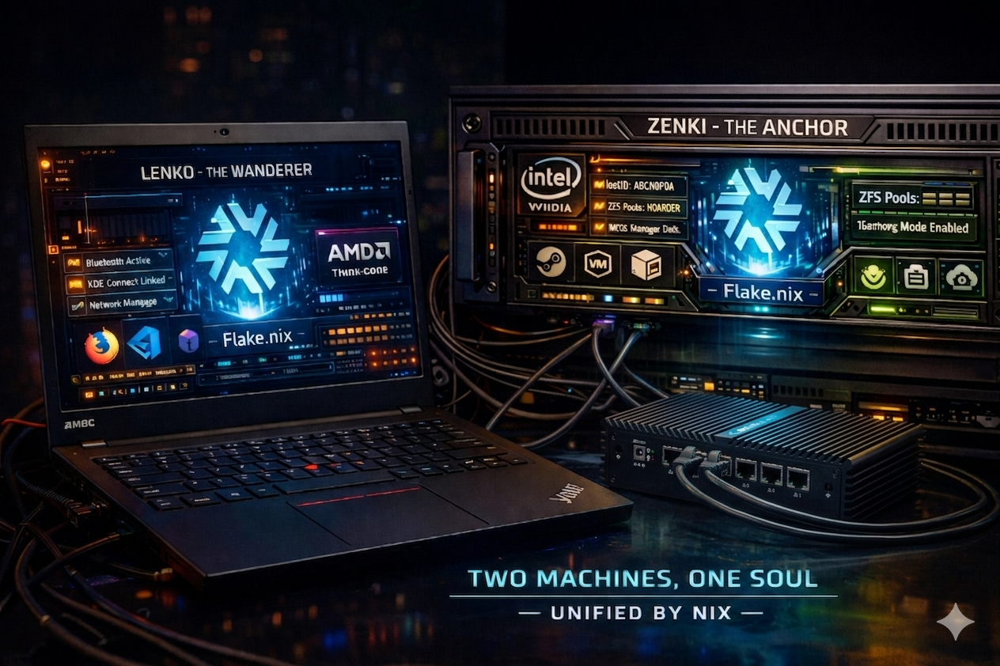

# The Legend of Lenko, Zenki, and Sensei: Three Machines, One Soul



## The Origin

In the realm of `/home/tom/nix-config`, there existed a great flake - a crystallization of pure declarative wisdom. From this single source of truth, three vessels were forged, each bearing a fragment of the same essence, yet destined for different purposes.

## Lenko — The Wanderer

Lenko emerged as a **Thinkpad T14**, forged with the heart of **AMD** (`kvm-amd` beats within). Born to roam, Lenko carries the spirit of mobility:

```nix
# The wanderer's essence
hardware.bluetooth.enable = true;  # To connect with the world
programs.kdeconnect.enable = true;  # To commune with distant devices
networking.networkmanager.enable = true;  # To adapt to any network
```

Lenko is the **scribe and messenger**, bearing tools of creation:
- [`firefox.nix`](home-manager/modules/firefox.nix) — the window to knowledge
- [`vscode.nix`](home-manager/modules/vscode.nix) — the forge of code
- [`printing.nix`](modules/printing.nix) — to manifest thoughts into paper

The wanderer knows rest, and thus carries [`hypridle.nix`](home-manager/modules/desktop/hypridle.nix) to slumber when idle. The GNOME keyring guards its secrets as it travels the digital highways.

## Zenki — The Anchor

Zenki arose as a **stationary titan**, powered by **Intel 14600K** (`kvm-intel` pulses through its circuits). It is the **server and gaming rig**, bound to one place but mighty:

```nix
# The anchor's essence
networking.hostId = "a8c00f0a";  # Its eternal identity
boot.zfs.extraPools = [ "hoarder-data" "impo-data" ];  # Its vast memory vaults
```

Zenki wields the power of **NVIDIA RTX 3090**, with custom fan control to temper its fury. It bears the **Intel QSV** for swift video transcoding. Through its **10Gbit Ethernet**, it stands as a fortress on VLAN 10.

The anchor is both **playground and sanctuary**:
- [`gaming.nix`](modules/gaming.nix) — Steam, GameMode, the realm of play
- [`libvirt.nix`](modules/virtual-machines/libvirt.nix) — to birth virtual worlds
- [`backup-daily.nix`](modules/zfs/backup-daily.nix) & [`backup-daily-weekly.nix`](modules/docker/backup-daily-weekly.nix) — the guardians of preservation

## Sensei — The Gatekeeper

Sensei emerged as the **silent guardian**, a headless server that watches over the network realm. It is the **router, firewall, and DHCP server**, standing at the gateway between the home network and the wider internet:

```nix
# The gatekeeper's essence
networking.useNetworkd = true;  # To command the network
services.kea.dhcp4.enable = true;  # To assign identities to devices
services.chrony.enable = true;  # To keep time in sync
boot.kernel.sysctl."net.ipv4.ip_forward" = 1;  # To bridge worlds
```

Sensei wields the power of **PPPoE** to connect to the outside world, and through its **bonded interfaces**, it manages multiple VLANs:
- **VLAN 10 (Common)** — The trusted realm for Lenko, Zenki, and known devices
- **VLAN 20 (Guest)** — The visiting quarters for allies
- **VLAN 30 (IoT)** — The domain of wild devices, carefully isolated
- **VLAN 99 (Management)** — Sensei's own sanctuary (`192.168.99.10`)

The gatekeeper bears tools of protection:
- [`kea.nix`](hosts/sensei/kea.nix) — the DHCP server that assigns identities
- [`unbound.nix`](hosts/sensei/unbound.nix) — the DNS resolver that answers queries
- [`nftables.nix`](hosts/sensei/nftables.nix) — the firewall that guards the gates
- [`wireguard.nix`](hosts/sensei/wireguard.nix) — the secure tunnel for remote access

Sensei has no face—no desktop, no display—yet it is the foundation upon which all other machines stand. Without Sensei, Lenko cannot roam, and Zenki cannot anchor.

## The Shared Soul

Though their forms differ, Lenko, Zenki, and Sensei share the **same soul**—the Nix flake that defines their being:


Their shared essence flows through:
- **[`common.nix`](modules/common.nix)** — The foundation: user "tom", timezone `Europe/Ljubljana`, Slovenian keyboard, zsh with starship
- **[`shell.nix`](modules/shell.nix)** — The voice: zsh with starship prompt
- **[`home-manager/users/tom.nix`](home-manager/users/tom.nix)** — The personal realm: packages, git, python, yazi, rofi

Lenko and Zenki also share:
- **[`desktop.nix`](modules/desktop.nix)** — The face: Hyprland, greetd, PipeWire, Waybar, fonts

All three breathe the same declarative air, all respond to the same `nixos-rebuild switch`, all inherit from the same modules.

## The Eternal Bond

When Tom sits at Lenko, he is the wanderer—coding in VS Code, browsing Firefox, connected to networks far and wide. When Tom sits at Zenki, he is the anchor—gaming in Steam, managing Docker containers, tending to the hoards of data.

And always, silently, Sensei watches—routing packets, assigning addresses, filtering threats, keeping time. The wanderer cannot wander without Sensei's guidance. The anchor cannot anchor without Sensei's foundation.

Yet in all places, his home is the same. His shell greets him identically. His Hyprland workspace feels familiar (on those machines that bear a face). His `nvim` awaits with the same configuration.

```nix
# From flake.nix, the declaration of their unity
nixosConfigurations = {
  sensei = nixpkgs.lib.nixosSystem { /* ... */ };
  zenki = nixpkgs.lib.nixosSystem { /* ... */ };
  lenko = nixpkgs.lib.nixosSystem { /* ... */ };
};
```

Three machines, one soul. The wanderer, the anchor, and the gatekeeper, bound by the immutable promise of Nix—**reproducible, declarative, eternal**.

---

*And thus, in the house of Tom, Lenko roams while Zenki stands guard, and Sensei watches over all—three vessels animated by the same flake, all serving the same master, all forever one.*