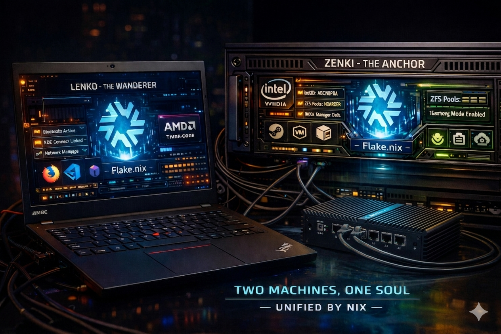
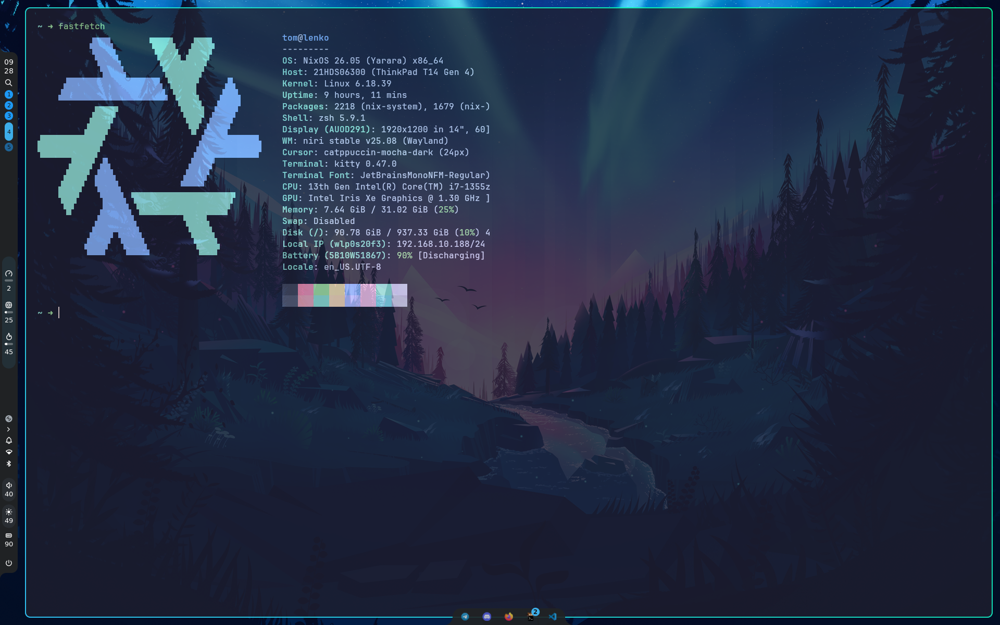

# The Legend of Lenko, Zenki, and Sensei: Three Machines, One Soul

## The Origin

In the realm of `/home/tom/nix-config`, there existed a great flake - a crystallization of pure declarative wisdom. From this single source of truth, three vessels were forged, each bearing a fragment of the same essence, yet destined for different purposes.

## Lenko — The Wanderer

Lenko emerged as a **Thinkpad T14 Gen 4**, forged with the heart of **Intel**. Born to roam, Lenko carries the spirit of mobility.

- Desktop environment: Niri + Noctalia
- Docker container support
- Virtual machine management via virt-manager
- Intel Quick Sync Video hardware acceleration
- Power management with upower
- Bluetooth connectivity
- KDE Connect
- Printing support
- WireGuard VPN
- PlatformIO support for microcontroller development
- CPU governor: schedutil for performance/power efficiency balance

## Zenki — The Anchor

Zenki arose as a **stationary titan**, powered by **Intel 14600K** (`kvm-intel` pulses through its circuits). It is the **server and gaming rig**, bound to one place but mighty.

- Desktop environment: Hyprland
- Full Docker container support
- SSH server
- ZFS filesystem with backup capabilities
- Virtual machine management via libvirt
- Intel Quick Sync Video hardware acceleration
- Intel CPU efficiency optimizations
- NVIDIA GPU support
- Gaming: Steam and gamemode

## Sensei — The Gatekeeper

Sensei emerged as the **silent guardian**, a headless server that watches over the network realm. It is the **router, firewall, and DHCP server**, standing at the gateway between the home network and the wider internet:

- Network routing and firewall (nftables)
- DHCP server (Kea)
- DNS resolver (Unbound)
- WireGuard VPN gateway
- ProtonVPN integration
- SSH server
- NTP time server (chrony)
- Network monitoring tools: ethtool, tcpdump, iftop, bandwhich, iperf3
- Wireshark CLI
- Connection tracking tools (conntrack)

## The Shared Soul

Though their forms differ, Lenko, Zenki, and Sensei share the **same soul** - the Nix flake that defines their being.

All three breathe the same declarative air, all respond to the same `nixos-rebuild switch`, all inherit from the same modules.

---

*And thus, in the house of Tom, Lenko roams while Zenki stands guard, and Sensei watches over all - three vessels animated by the same flake, all serving the same master, all forever one.*