# Nix Configuration Module Dependencies

## Visual Dependency Graph

```mermaid
%%{init: {'theme': 'base', 'themeVariables': { 'ranksep': '120' }}}%%
graph TD
    %% Entry Points
    flake[flake.nix<br/>Entry Point] --> zenki_cfg[hosts/zenki/configuration.nix]
    flake --> lenko_cfg[hosts/lenko/configuration.nix]
    flake --> nixvim_mod[modules/nixvim.nix]
    flake --> tom_user[home-manager/users/tom.nix]

    %% External Dependencies
    flake -->|nixpkgs inputs| nixpkgs[nixpkgs]
    flake -->|nixvim input| nixvim[nixvim]
    flake -->|home-manager input| home_manager[home-manager]
    flake -->|NUR input| nur[NUR]

    %% Variables
    vars[vars.nix<br/>Global Variables] --> flake
    secrets[secrets.nix] --> vars

    %% Zenki Host Configuration
    zenki_cfg --> zenki_hw[hosts/zenki/hardware-configuration.nix]
    zenki_cfg --> zenki_net[hosts/zenki/networking.nix]
    zenki_cfg --> shell_mod[modules/shell.nix]
    zenki_cfg --> common_mod[modules/common.nix]
    zenki_cfg --> docker_init[modules/docker/init.nix]
    zenki_cfg --> ssh_mod[modules/ssh.nix]
    zenki_cfg --> zfs_init[modules/zfs/init.nix]
    zenki_cfg --> desktop_mod[modules/desktop.nix]
    zenki_cfg --> gaming_mod[modules/gaming.nix]
    zenki_cfg --> utilities_mod[modules/utilities.nix]
    zenki_cfg --> sudo_mod[modules/sudo.nix]
    zenki_cfg --> libvirt[modules/virtual-machines/libvirt.nix]
    zenki_cfg --> intel_qsv[modules/hardware/intel/intel-qsv.nix]
    zenki_cfg --> intel_eff[modules/hardware/intel/efficiency.nix]
    zenki_cfg --> nvidia_init[modules/hardware/nvidia/init.nix]

    %% Lenko Host Configuration
    lenko_cfg --> lenko_hw[hosts/lenko/hardware-configuration.nix]
    lenko_cfg --> lenko_net[hosts/lenko/networking.nix]
    lenko_cfg --> shell_mod
    lenko_cfg --> common_mod
    lenko_cfg --> desktop_mod
    lenko_cfg --> sudo_mod
    lenko_cfg --> docker_base[modules/docker/init_base.nix]
    lenko_cfg --> utilities_mod
    lenko_cfg --> printing_mod[modules/printing.nix]
    lenko_cfg --> virt_manager[modules/virtual-machines/virt-manager.nix]
    lenko_cfg --> lenko_mounts[hosts/lenko/mounts.nix]

    %% Home Manager User Configuration
    tom_user -->|hostName=zenki| zenki_hm[home-manager/hosts/zenki/default.nix]
    tom_user -->|hostName=lenko| lenko_hm[home-manager/hosts/lenko/default.nix]
    tom_user --> pkgs_base[home-manager/modules/packages-base.nix]
    tom_user --> kitty_mod[home-manager/modules/kitty.nix]
    tom_user --> yazi_mod[home-manager/modules/yazi.nix]
    tom_user --> rofi_mod[home-manager/modules/rofi.nix]
    tom_user --> git_mod[home-manager/modules/git.nix]
    tom_user --> python_mod[home-manager/modules/python.nix]

    %% Zenki Home Manager
    zenki_hm --> zenki_pkgs[home-manager/hosts/zenki/packages.nix]
    zenki_hm --> hyprland_base[home-manager/modules/desktop/hyprland-base.nix]
    zenki_hm --> gaming_hm[home-manager/modules/gaming.nix]

    %% Lenko Home Manager
    lenko_hm --> lenko_pkgs[home-manager/hosts/lenko/packages.nix]
    lenko_hm --> hyprland_base
    lenko_hm --> firefox_mod[home-manager/modules/firefox.nix]
    lenko_hm --> vscode_mod[home-manager/modules/vscode.nix]

    %% Hyprland Base Module
    hyprland_base --> waybar_base[home-manager/modules/desktop/waybar-base.nix]
    hyprland_base --> hyprlock[home-manager/modules/desktop/hyprlock.nix]
    hyprland_base --> cursor[home-manager/modules/desktop/cursor.nix]
    hyprland_base --> hyprpaper[home-manager/modules/desktop/hyprpaper.nix]
    hyprland_base -->|hostName=zenki| zenki_hypr[home-manager/hosts/zenki/hyprland.nix]
    hyprland_base -->|hostName=lenko| lenko_hypr[home-manager/hosts/lenko/hyprland.nix]

    %% Zenki Hyprland
    zenki_hypr --> zenki_waybar[home-manager/hosts/zenki/waybar.nix]

    %% Lenko Hyprland
    lenko_hypr --> lenko_waybar[home-manager/hosts/lenko/waybar.nix]
    lenko_hypr --> hypridle[home-manager/modules/desktop/hypridle.nix]
    lenko_hypr --> hyprshot[home-manager/modules/desktop/hyprshot.nix]

    %% Docker Module
    docker_init --> docker_base
    docker_init --> docker_net[modules/docker/network.nix]
    docker_init --> docker_backup_daily[modules/docker/backup-daily-weekly.nix]
    docker_init --> docker_backup_quarterly[modules/docker/backup-quarterly.nix]
    docker_init --> docker_deploy[modules/docker/deploy.nix]
    docker_init --> docker_vector[modules/docker/vector.nix]

    %% ZFS Module
    zfs_init --> zfs_backup_daily[modules/zfs/backup-daily.nix]
    zfs_init --> zfs_backup_quarterly[modules/zfs/backup-quarterly.nix]

    %% NVIDIA Module
    nvidia_init --> nvidia_fan[modules/hardware/nvidia/nvidia-fan-control.nix]

    %% Styling
    classDef entry fill:#ff6b6b,stroke:#c92a2a,stroke-width:3px,color:#fff
    classDef host fill:#4dabf7,stroke:#1864ab,stroke-width:2px,color:#fff
    classDef module fill:#69db7c,stroke:#2b8a3e,stroke-width:2px,color:#fff
    classDef hm fill:#ffd43b,stroke:#f08c00,stroke-width:2px,color:#000
    classDef ext fill:#adb5bd,stroke:#495057,stroke-width:2px,color:#000

    class flake entry
    class zenki_cfg,lenko_cfg host
    class shell_mod,common_mod,desktop_mod,gaming_mod,utilities_mod,sudo_mod module
    class docker_init,docker_base,docker_net module
    class ssh_mod,zfs_init,libvirt,intel_qsv,intel_eff,nvidia_init module
    class printing_mod,virt_manager module
    class nixvim_mod module
    class tom_user,zenki_hm,lenko_hm hm
    class pkgs_base,kitty_mod,yazi_mod,rofi_mod,git_mod,python_mod hm
    class hyprland_base,waybar_base,hyprlock,cursor,hyprpaper hm
    class hypridle,hyprshot hm
    class firefox_mod,vscode_mod hm
    class zenki_hypr,lenko_hypr,zenki_waybar,lenko_waybar hm
    class zenki_pkgs,lenko_pkgs hm
    class docker_backup_daily,docker_backup_quarterly,docker_deploy,docker_vector module
    class zfs_backup_daily,zfs_backup_quarterly module
    class nvidia_fan module
    class nixpkgs,nixvim,home_manager,nur ext
```



## Detailed Module Descriptions

### Entry Points

| File | Purpose |
|------|---------|
| [`flake.nix`](flake.nix:1) | Main entry point defining NixOS configurations for both hosts |
| [`vars.nix`](vars.nix:1) | Global variables and configuration values |
| [`secrets.nix`](secrets.nix:1) | Sensitive configuration data (not shown) |

### Host Configurations (NixOS)

#### Zenki (Desktop/Gaming Server)
| File | Imports |
|------|---------|
| [`hosts/zenki/configuration.nix`](hosts/zenki/configuration.nix:1) | hardware, networking, shell, common, docker, ssh, zfs, desktop, gaming, utilities, sudo, libvirt, intel-qsv, intel-efficiency, nvidia |

#### Lenko (Laptop)
| File | Imports |
|------|---------|
| [`hosts/lenko/configuration.nix`](hosts/lenko/configuration.nix:1) | hardware, networking, common, shell, desktop, sudo, docker-base, utilities, printing, virt-manager, mounts |

### System Modules

| Module | Purpose | Used By |
|--------|---------|---------|
| [`modules/common.nix`](modules/common.nix:1) | User setup, locale, Nix settings | Both hosts |
| [`modules/shell.nix`](modules/shell.nix:1) | Zsh and Starship configuration | Both hosts |
| [`modules/desktop.nix`](modules/desktop.nix:1) | Hyprland, greetd, pipewire, fonts | Both hosts |
| [`modules/gaming.nix`](modules/gaming.nix:1) | Steam, GameMode, hardware graphics | Zenki |
| [`modules/utilities.nix`](modules/utilities.nix:1) | Common system packages | Both hosts |
| [`modules/sudo.nix`](modules/sudo.nix:1) | Sudo configuration | Both hosts |
| [`modules/ssh.nix`](modules/ssh.nix:1) | OpenSSH server | Zenki |
| [`modules/printing.nix`](modules/printing.nix:1) | CUPS and SANE for printing/scanning | Lenko |
| [`modules/nixvim.nix`](modules/nixvim.nix:1) | Neovim with plugins | Both hosts (via flake) |

### Docker Module Hierarchy

```
modules/docker/init.nix (full docker setup - Zenki)
├── modules/docker/init_base.nix (basic docker - Lenko)
├── modules/docker/network.nix
├── modules/docker/backup-daily-weekly.nix
├── modules/docker/backup-quarterly.nix
├── modules/docker/deploy.nix
└── modules/docker/vector.nix
```

### ZFS Module Hierarchy

```
modules/zfs/init.nix
├── modules/zfs/backup-daily.nix
└── modules/zfs/backup-quarterly.nix
```

### Hardware Modules

| Module | Purpose | Used By |
|--------|---------|---------|
| [`modules/hardware/intel/intel-qsv.nix`](modules/hardware/intel/intel-qsv.nix:1) | Intel Quick Sync Video | Zenki |
| [`modules/hardware/intel/efficiency.nix`](modules/hardware/intel/efficiency.nix:1) | CPU power efficiency | Zenki |
| [`modules/hardware/nvidia/init.nix`](modules/hardware/nvidia/init.nix:1) | NVIDIA GPU with PRIME offload | Zenki |
| [`modules/hardware/nvidia/nvidia-fan-control.nix`](modules/hardware/nvidia/nvidia-fan-control.nix:1) | Custom fan curve | Zenki |

### Virtual Machines

| Module | Purpose | Used By |
|--------|---------|---------|
| [`modules/virtual-machines/libvirt.nix`](modules/virtual-machines/libvirt.nix:1) | Full libvirt/KVM setup | Zenki |
| [`modules/virtual-machines/virt-manager.nix`](modules/virtual-machines/virt-manager.nix:1) | GUI management only | Lenko |

### Home Manager User Configuration

| File | Purpose |
|------|---------|
| [`home-manager/users/tom.nix`](home-manager/users/tom.nix:1) | Base user config, imports host-specific |

### Home Manager Base Modules

| Module | Purpose |
|--------|---------|
| [`home-manager/modules/packages-base.nix`](home-manager/modules/packages-base.nix:1) | Base packages (git, kitty, etc.) |
| [`home-manager/modules/kitty.nix`](home-manager/modules/kitty.nix:1) | Kitty terminal configuration |
| [`home-manager/modules/yazi.nix`](home-manager/modules/yazi.nix:1) | Yazi file manager |
| [`home-manager/modules/rofi.nix`](home-manager/modules/rofi.nix:1) | Rofi launcher with calc plugin |
| [`home-manager/modules/git.nix`](home-manager/modules/git.nix:1) | Git configuration |
| [`home-manager/modules/python.nix`](home-manager/modules/python.nix:1) | Python with requests |

### Host-Specific Home Manager

#### Zenki
| File | Imports |
|------|---------|
| [`home-manager/hosts/zenki/default.nix`](home-manager/hosts/zenki/default.nix:1) | packages, hyprland-base, gaming |

#### Lenko
| File | Imports |
|------|---------|
| [`home-manager/hosts/lenko/default.nix`](home-manager/hosts/lenko/default.nix:1) | packages, hyprland-base, firefox, vscode |

### Desktop Environment Modules

#### Hyprland Base
| File | Imports |
|------|---------|
| [`home-manager/modules/desktop/hyprland-base.nix`](home-manager/modules/desktop/hyprland-base.nix:1) | waybar-base, hyprlock, cursor, hyprpaper, host/hyprland.nix |

#### Desktop Components
| Module | Purpose |
|--------|---------|
| [`home-manager/modules/desktop/waybar-base.nix`](home-manager/modules/desktop/waybar-base.nix:1) | Waybar status bar base config |
| [`home-manager/modules/desktop/hyprlock.nix`](home-manager/modules/desktop/hyprlock.nix:1) | Screen locker |
| [`home-manager/modules/desktop/cursor.nix`](home-manager/modules/desktop/cursor.nix:1) | Catppuccin cursor theme |
| [`home-manager/modules/desktop/hyprpaper.nix`](home-manager/modules/desktop/hyprpaper.nix:1) | Wallpaper manager |
| [`home-manager/modules/desktop/hypridle.nix`](home-manager/modules/desktop/hypridle.nix:1) | Idle/lock timer (Lenko) |
| [`home-manager/modules/desktop/hyprshot.nix`](home-manager/modules/desktop/hyprshot.nix:1) | Screenshot tool (Lenko) |

#### Host-Specific Waybar
| File | Purpose |
|------|---------|
| [`home-manager/hosts/lenko/waybar.nix`](home-manager/hosts/lenko/waybar.nix:1) | Laptop-specific modules (battery, bluetooth, etc.) |
| [`home-manager/hosts/zenki/waybar.nix`](home-manager/hosts/zenki/waybar.nix:1) | Desktop-specific modules (temperature) |

#### Host-Specific Hyprland
| File | Purpose |
|------|---------|
| [`home-manager/hosts/lenko/hyprland.nix`](home-manager/hosts/lenko/hyprland.nix:1) | Laptop monitor setup, keybinds |
| [`home-manager/hosts/zenki/hyprland.nix`](home-manager/hosts/zenki/hyprland.nix:1) | Desktop GPU offload configuration |

### Application Modules

| Module | Purpose | Used By |
|--------|---------|---------|
| [`home-manager/modules/firefox.nix`](home-manager/modules/firefox.nix:1) | Firefox with extensions | Lenko |
| [`home-manager/modules/vscode.nix`](home-manager/modules/vscode.nix:1) | VS Code with extensions | Lenko |
| [`home-manager/modules/gaming.nix`](home-manager/modules/gaming.nix:1) | Gaming-related home-manager config | Zenki |

### Host-Specific Packages

| File | Purpose |
|------|---------|
| [`home-manager/hosts/lenko/packages.nix`](home-manager/hosts/lenko/packages.nix:1) | Laptop-specific packages |
| [`home-manager/hosts/zenki/packages.nix`](home-manager/hosts/zenki/packages.nix:1) | Desktop-specific packages (empty) |

## Summary Statistics

- **Total Hosts**: 2 (zenki, lenko)
- **System Modules**: 15
- **Home Manager Modules**: 13
- **Docker Sub-modules**: 6
- **ZFS Sub-modules**: 3
- **Hardware Sub-modules**: 4
- **VM Sub-modules**: 2
